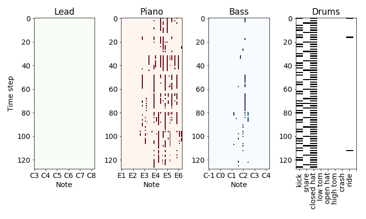

# Music creation using VAEs
The main notebooks for training the models and generating music are
* `1-vae.ipynb`
* `2-beta-vae.ipynb`

Data preprocessing is done using codes in the notebooks
* `A_filter.ipynb` - filtering the raw midi data
* `B_map_instruments` - remapping midi instruments
* `C_splice_tracks` - splicing the tracks to create the training examples
* `D_listen_to_data`: listening to training examples

Generated new musical samples are in the `samples` directory, both in midi and mp3 format. Below is an example of a generated four-track sequence.

