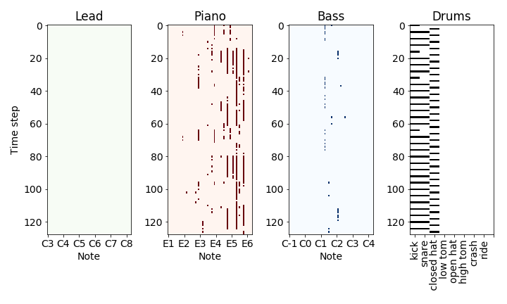

# Music creation using VAEs
This is a project work for the 2019 course CS-E4890 Deep Learning in Aalto University. Generated new music can be found in the `samples` directory, both in midi and mp3 format. If you don't want to download the generated samples, you can listen to some examples also [here](https://soundcloud.com/user-297260498/sets/vae-music)!

The main notebooks for training the models and generating music are
* `1-vae.ipynb` 
* `2-beta-vae.ipynb` (not used in the project)

Data preprocessing is done using codes in the notebooks
* `A_filter.ipynb` - filtering the raw midi data
* `B_map_instruments` - remapping midi instruments
* `C_splice_tracks` - splicing the tracks to create the training examples
* `D_listen_to_data` - listening to training examples

 Below is an example pianoroll for a generated four-track sequence. 

